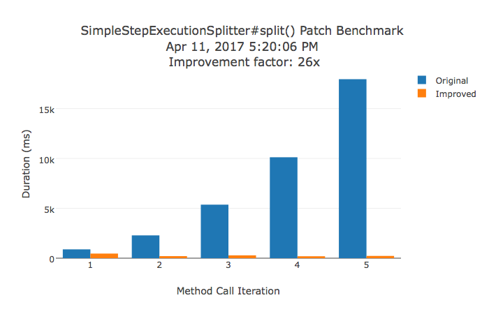

# spring-batch-large-partitions-improvement
Performance improvement when creating a large number of step executions within a single job instance.

## Maven Structure

* `large-step-fix-reactor`
  * `large-step-job-test` only contains tests, no source code. When run by itself it baselines behavior of the original Spring Batch code.
  * `large-step-patch` overrides Spring Batch code with new files using the same package and class names. Uses the same job test in `large-step-job-test` by importing it as a test jar.

## Instructions

Run the following Maven command on `large-step-fix-reactor`

```
mvn clean verify
```


## The Approach

The sample job used to test performance uses a partition-within-a-partition step. Each time a outside parent partition is created, `SimpleStepExecutionSplitter#split` queries the Spring Batch tables to double check if the step is a restart. This originally scanned the entire table for each step.

The patch opens up a new method on `JobRepository` which allows `SimpleStepExecutionSplitter` to retreive all the step executions at the time of partitioning. By assuming no colliding step executions will be inserted by other threads for the same job instance, the splitting is more efficient.

## Benchmarking

An AOP profiler is used to measure the duration of each successive call to `SimpleStepExecutionSplitter#split()` in order to measure the performance improvement.

The `verify` phase is bound to an integration test that compares the two job runs. If the overall improvement factor is not greater than 10, the integration test fails. Otherwise, it generates a Plot.ly HTML bar chart of the two job runs inside the `benchmark-report` folder.

To offer a sense for the magnitude of the improvement, a sample benchmark result (running on a MacBook Air) is committed for convenience:

